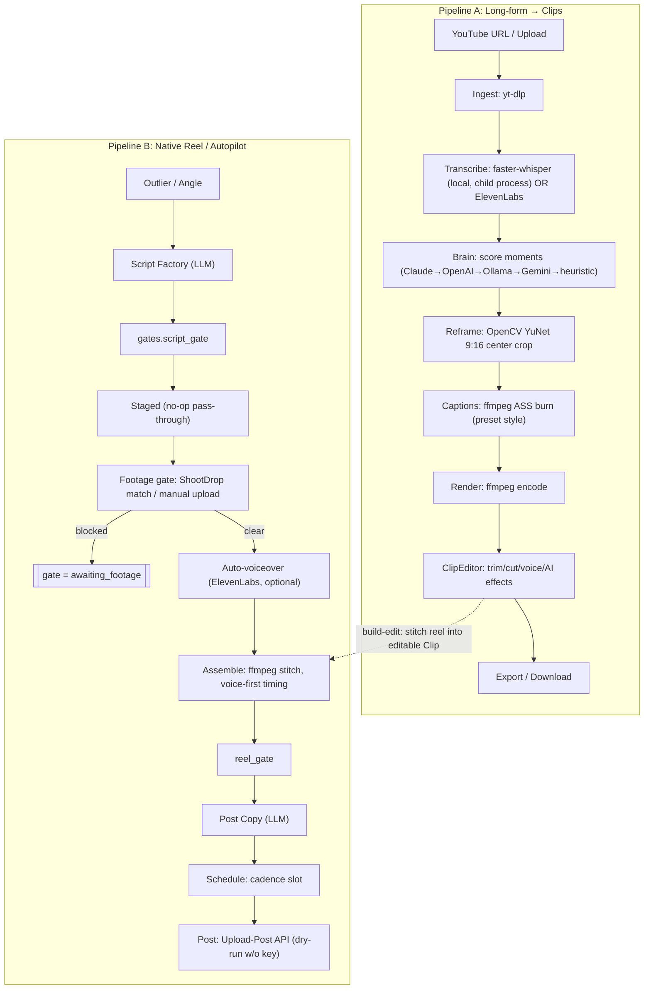
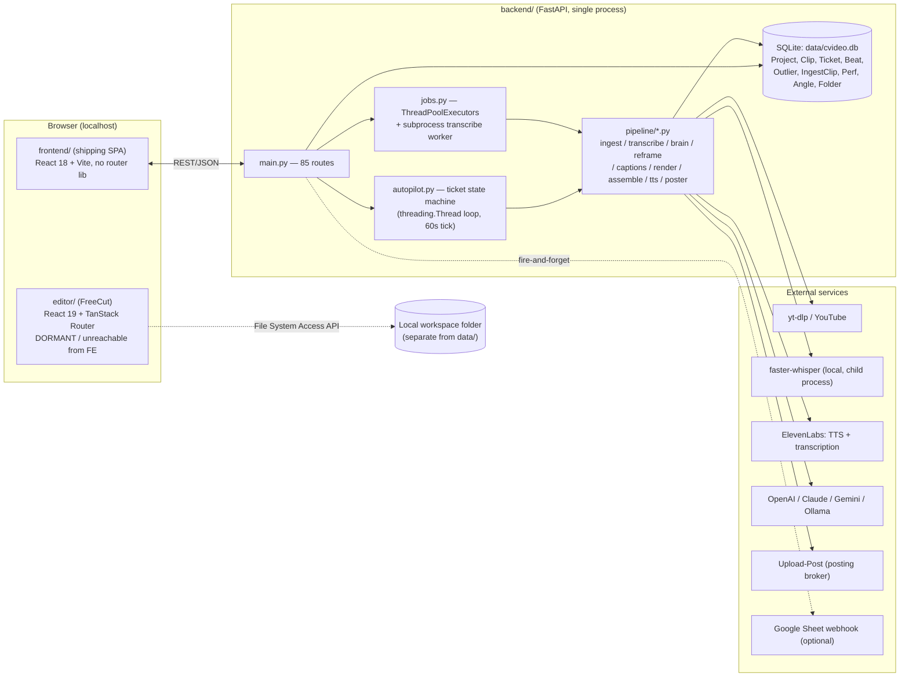
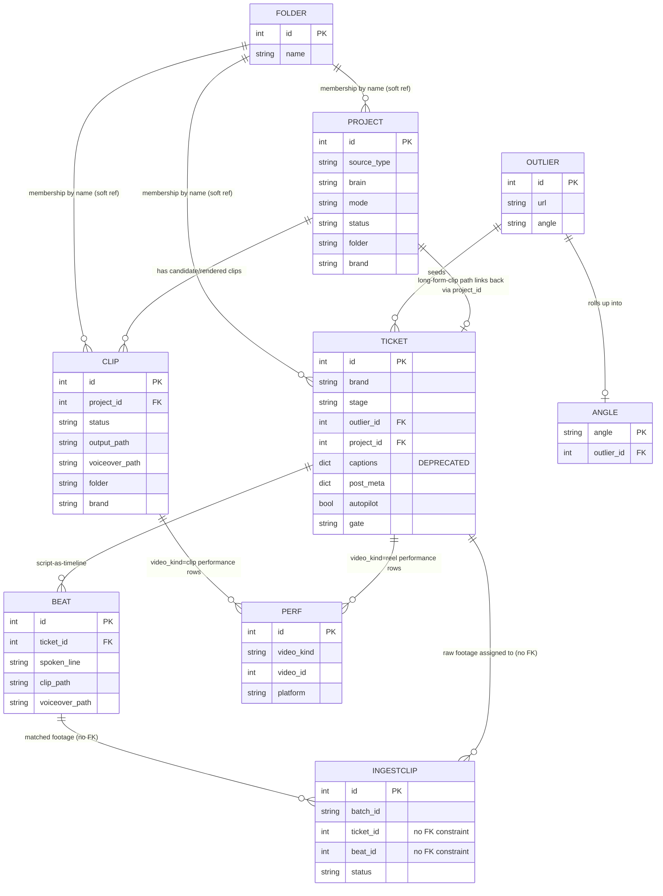

# CVideo Complete Audit

**Method note:** This audit was produced read-only, by tracing actual code paths (route handlers, function call chains, type definitions, DB migrations) rather than trusting file/feature names or documentation. Six deep research passes fed this synthesis, covering: (1) all product/vision docs, (2) the `backend/` FastAPI pipeline, (3) `editor/` routing/state/storage, (4) `editor/` rendering/export pipeline, (5) `frontend/` app + auth/billing sweep, (6) dead-code/test/design-token sweep. Every claim below is labeled **VERIFIED** (code read directly), **INFERRED** (reasonable synthesis, not fully traced), or **UNKNOWN** (needs live credentials/runtime). File:line citations are given wherever practical. No application code was modified to produce this report.

---

## 1. Executive Summary

**What CVideo is (VERIFIED, from `README.md:1-5`, `CONTEXT.md:1-13`):** CVideo is Dennis's personal, local, single-user clone of wayinvideo/OpusClip — a tool that ingests long-form video (YouTube URL or upload), auto-transcribes it, uses an AI "brain" to pick the most viral-feeling moments, reframes to 9:16, burns TikTok-style captions, and lets you trim/caption/voice-over/export the result. On top of that core clip pipeline, CVideo has grown a second, more ambitious layer: **Autopilot**, a ticket-based content-production and (eventually) auto-posting system that walks a piece of content through an 8-stage lifecycle (`outlier → scripted → staged → sourced → assembled → ready → scheduled → posted`) for one or more per-brand JSON "cartridges" (voice/tone rules, banned phrases, cadence, autonomy level).

**Who it's for:** One person — Dennis — running this on his own Windows laptop for his own brands (NoCrapDiet, SemSeo, MissedYu, Weight Loss 30 Day Challenge). There is no user account system, no multi-tenant data model, and no billing (§5, §8, §9 confirm this exhaustively). A parallel, explicitly-flagged-as-unproven idea in the docs is to eventually sell this as a wedge SaaS product to med-spas/real-estate/financial-advisor niches (`docs/context/decisions.md`), but nothing in the code reflects that yet.

**The problem it solves:** Manually clipping, captioning, and posting short-form video is slow and repetitive; CVideo automates the mechanical parts (transcription, moment-picking, reframing, captioning, assembling, and — optionally — scheduling/posting) while keeping a human in the loop at configurable gate points.

**Primary value proposition:** No subscription, runs entirely on Dennis's own PC (or a cloud "brain" if he prefers), and — per the Autopilot layer — can eventually run with minimal supervision once a brand cartridge is trusted enough (`autonomy: hands_off`).

**Stage of development:** Substantially built, not polished. The backend (§6/§9) has zero stub API routes — every one of ~85 FastAPI endpoints does real work. The Autopilot state machine is genuinely crash-safe (DB-row-persisted, not in-memory). The `editor/` sub-app (a vendored fork called FreeCut) is a remarkably mature, professional-grade GPU video renderer — but it is **currently disconnected from the running product** (§4, §6). This is a "deep in places, disjointed as a whole" stage: individual subsystems are well-engineered, but the product's outer shell (navigation, docs, which editor is "the" editor) has drifted out of sync with itself.

**Biggest strengths:**
- The AI/LLM layer has a real multi-provider fallback chain (Claude→OpenAI→Ollama→Gemini) that never hard-fails a request (`backend/app/pipeline/llm.py`).
- Autopilot's state machine is genuinely resumable across crashes/restarts — not just described as such.
- The `editor/` renderer (WebGPU compositor, 13 transitions, 33 effects, real proxy/caching pipeline) is production-quality engineering, unusually well-tested (429 test files) for a personal project.
- Backend has essentially zero dead-stub routes; every endpoint traced does real work.

**Biggest weaknesses:**
- **Two unconnected editors exist.** `frontend/`'s built-in `ClipEditor` is the shipping editor; the far more capable `editor/` (FreeCut) sits vendored and fully built but wired to nothing (§4, §6, §16). This is the single biggest structural confusion in the repo.
- **No automated regression testing on the backend** — `test_api.py`/`test_brain.py`/`test_full.py` are manual scripts requiring a live server, GPU, Ollama, and real YouTube URLs; there is no CI-safe test layer for the Python side (§6, §12).
- **Docs are stale relative to code** in several places (README's roadmap section, `docs/context/overview.md`, `docs/editor/freecut-editor.md`, a dead link to a nonexistent `docs/autopilot/master-plan.md`) — anyone onboarding from docs alone would be misled about what's actually running (§1 of the docs-audit pass, reflected throughout).
- **No job queue** — all "background work" is thread-pool/subprocess calls; a backend crash mid-render leaves a clip stuck at `status="rendering"` forever with no automatic recovery (§6, §12).
- File uploads (beyond shoot-drop) have zero size/type validation (§13).

**Is the product coherent right now?** **Partially.** The core clip pipeline (ingest→transcribe→brain→reframe→caption→render) is coherent and functional. The Autopilot layer bolted on top is internally coherent but only lightly proven end-to-end (the team's own docs say so: `docs/timeline/06...:41-51`, "end-to-end autonomous run is NOT proven"). The editor story is **not** coherent: two full editors exist, only one is live, and the vendored one's own documentation still describes itself as embedded when it isn't.

---

## 2. Product Model

**Target users:** Currently exactly one person (Dennis), running multiple content "brands" through the same tool. A speculative future target (unvalidated in code) is small local-service businesses (med spas, real estate agents, financial advisors) buying CVideo as a hosted SaaS, where each customer = one brand cartridge.

**Core use cases (VERIFIED across `backend/app/main.py` routes and `frontend/src/App.tsx`):**
1. Long-form YouTube video → auto-clipped, captioned vertical shorts ("moments" mode).
2. Native/original reels assembled from silent B-roll + separately recorded or AI (ElevenLabs) voiceover, driven by a written script ("Beats").
3. Autopilot-run content production: an idea ("outlier"/"angle") is turned into a script, gated for footage, assembled, given post copy, scheduled, and (optionally) posted — with human approval gates configurable per brand.

**Main inputs:** a YouTube URL or uploaded video file; a written script or AI-generated script; raw "shoot drop" B-roll clips; recorded or synthesized voiceover; brand cartridge JSON (voice rules, cadence, autonomy).

**Main outputs:** rendered MP4 clips/reels (9:16, burned captions, optional AI effects), post copy (captions/hashtags/YouTube title+description+tags) per platform, and (if configured) an actual scheduled/posted video via the Upload-Post broker.

**Expected user journey:** capture an idea or long-form source → let the AI or Dennis write/pick the moment/script → gather or auto-source footage → assemble → review/edit in the built-in `ClipEditor` → (optionally) auto-voiceover → export/post → log performance in Results → the Autopilot loop feeds learnings back into future scripts via `learn.py`.

**How CVideo differs from a basic AI video generator:** it's not a "type a prompt, get a video" tool — moment-picking and scripting are AI-assisted but the assembly/footage is still substantially human-directed (Dennis films the B-roll himself), and there's a whole content-operations layer (swipe file of "outliers," per-brand voice rules, a scheduling/posting/performance-measurement loop with a `learn.py` feedback mechanism) that a generic AI-video tool doesn't have.

**Unclear product decisions:**
- Whether `editor/` (FreeCut) is meant to ever replace `frontend/`'s `ClipEditor`, or exist as a separate/future product — the docs contradict each other on this (§6 below), and no code currently answers the question.
- Whether Autopilot is "the product" or a power-user layer on top of the core clipping tool — the UI folds it into the same Kanban board (`Board` component) as manual workflow, which is a reasonable design choice but isn't stated as deliberate anywhere.
- The SaaS-wedge idea (`docs/context/decisions.md`) is explicitly "not yet run" and has zero code footprint — it's a possible future, not a current direction.

**One-sentence product definition:** *CVideo is a solo-operator's local content factory that turns long-form video or a written script into captioned vertical shorts, with an optional semi-autonomous "Autopilot" layer that can script, assemble, schedule, and (with real credentials) post that content on a recurring per-brand cadence.*

---

## 3. Current User Journey

**Landing / initial launch (VERIFIED):** There is no marketing landing page for CVideo itself — `install.cmd`/`serve.cmd`/`scripts/start.ps1` launch the backend (`uvicorn`, port 8000) and `frontend/` (Vite dev server or built static files served by the backend's SPA mount, `backend/app/main.py` static mount at the end of the file) at `http://localhost:5173` (dev) or wherever the built `frontend/dist` is served from. First screen is `App.tsx`'s sidebar-navigated shell — no splash/onboarding, straight into "Home."

**Sign-up / login:** **None exists.** There is no login form, no password, no session cookie, no JWT (§9, VERIFIED via full grep). The only access-control primitive is an opt-in shared `X-API-Token`/bearer string (`CVIDEO_API_TOKEN` env var, `backend/app/main.py:38-51`), which is off by default. If a user opened this expecting an account system, there is nothing to sign into — this is by design for a solo local tool, but it means the app cannot currently be handed to a second person without everyone sharing one token and one dataset.

**Onboarding:** None. `install.cmd` prompts for ElevenLabs/OpenAI keys once at install time (README.md:24-25) — that's the entire "onboarding."

**Creating a project:** From **Home**, the user provides a YouTube URL or uploads a file (`POST /api/projects` or `/api/projects/upload`, `main.py:265,280`) → a `Project` row is created, `submit_analyze()` (`jobs.py`) runs the ingest→transcribe→brain→reframe pipeline on a single-worker thread pool. **Failure point:** transcription runs in a genuinely isolated child process specifically because the RTX 5070 (Blackwell GPU) can segfault the whole backend if it stays in-process (`jobs.py`, `transcribe_worker.py`) — this is a real, previously-hit crash risk that's been engineered around, not a hypothetical.

**Providing a script/media/source (native-reel path):** In **Ideas/Intake**, an "outlier" (viral reference) or a raw idea is turned into a `Ticket` (`POST /api/tickets`, `/from-script`, `/from-outlier/{oid}`). AI can write the script (`Script Factory` → `POST /api/tickets/{tid}/script-factory`), hooks (`Hook Forge`), and eventually post copy — all backed by the multi-provider LLM fallback chain. **Failure point:** if all four LLM providers fail (no keys, no Ollama running, network down), the caller falls back to a deterministic heuristic (`_fallback_script` etc.) rather than erroring — a good failure mode, but it means a silently degraded (non-AI) script could ship without the user necessarily noticing the fallback happened.

**Configuring a video:** aspect ratio, caption preset (capcut/hormozi/beasty/clean), resolution (1080p/1440p/4k — though editor docs note reels are effectively fixed at 1080×1920 for the reframe/render path), brand assignment, autopilot toggle, auto-voiceover toggle — all set on the `Project`/`Clip`/`Ticket` rows via PATCH routes.

**Generating assets (Beats/native path):** raw B-roll drops into **ShootDrop** (a watched-folder or in-app drop zone, `backend/app/pipeline/shootdrop.py`), auto-matched to script Beats by a confidence-scored matcher; ElevenLabs synthesizes voiceover per Beat if `auto_voiceover` is on. **Failure point:** the shoot-drop folder watcher polls every 10s and needs two stable size-reads before ingesting a file — fine for normal use, but a very slow/interrupted file copy could be picked up mid-write in edge cases; no automated test proves this doesn't happen.

**Editing/reviewing:** The **`ClipEditor`** inside `frontend/src/App.tsx` (not `editor/`) is where trimming, cutting, splitting, caption-style editing, AI effects (zoom/SFX), and voiceover recording/replacement happen — this is the live, shipping editor. **Known limitation (documented in code, per rendering-pipeline audit of the DB comments):** the Cut tool and per-scene voiceover are mutually exclusive on the same clip (`backend/app/db.py` comments imply voice-first timing vs. cut-based timing conflict) — a real feature gap the user will hit if they try to do both.

**Rendering/exporting:** `POST /api/clips/{cid}/render` (background thread-pool job) invokes the ffmpeg-based render pipeline (`pipeline/render.py`, `assemble.py`, `effects.py`). **Failure point:** because this is a plain `ThreadPoolExecutor` submission with no persisted job queue, a backend crash mid-render leaves the `Clip.status` stuck at `"rendering"` with no automatic retry or recovery — the user would need to notice and manually re-trigger.

**Managing previous projects:** **Home**/folders UI, backed by full CRUD routes (`/api/projects`, `/api/folders`) — functional, no gaps found.

**Billing/upgrading:** **Does not exist.** No Stripe, no plan/credit/quota model anywhere in the codebase (§5, §9 — exhaustively confirmed by grep). Any user expecting a pricing page or usage limits will find none; the app has no concept of "running out" of anything except the underlying provider's own API quota (which CVideo does not track or surface).

---

## 4. Complete Page and Route Inventory

*"Route" here means both the FastAPI routes serving as the app's true backend API, and the two separate frontend UI surfaces (`frontend/` = shipping app, `editor/` = dormant vendored fork).*

### 4a. `frontend/` — the shipping product UI (single-page app, `App.tsx`, one route per sidebar view; VERIFIED)

| Route/View | Page purpose | Main components | Data source | Current status | Problems |
|---|---|---|---|---|---|
| Home | Project folders, ingest new source (URL/upload) | `Home` (App.tsx) | `/api/projects*`, `/api/folders*` | Fully implemented | None found |
| Ideas / Intake | Swipe file of viral references ("outliers") + raw-footage ShootDrop bin | `Intake`, `ShootDrop` (App.tsx:988,824) | `/api/outliers*`, `/api/shootdrop*` | Fully implemented | ShootDrop matching confidence not surfaced clearly in UI per code comments |
| Create videos / Board | Kanban board across the Ticket lifecycle; Autopilot control strip | `Board` (App.tsx:181) | `/api/tickets*`, `/api/autopilot*` | Fully implemented | Autopilot autonomy="off" doesn't explicitly stop a ticket from being ungated (see §6, §9) |
| Video workspace | Per-ticket page: Beats (script+shot cues+clip/VO), AI script/hook gen, assemble, post-copy | `VideoWorkspace` (App.tsx:464) | `/api/beats/*`, `/api/tickets/{id}/*` | Fully implemented | "Open in editor" only reaches `ClipEditor`, never `editor/` (FreeCut) |
| `ClipEditor` (in-app editor) | Trim/cut/split/caption-style/AI-effects/voiceover editor for a single clip | `ClipEditor` (App.tsx:2042+) | `/api/clips/{id}/*` | Fully implemented, actively used | Cut + per-scene voice mutually exclusive per DB comments |
| Schedule / Queue | Schedule/post-now to TikTok/IG/YT via Upload-Post | `Queue` (App.tsx:1208) | `/api/queue`, `/api/tickets/{id}/schedule`,`/post` | Implemented, **dry-run unless `UPLOAD_POST_API_KEY` set** | Live posting is UNKNOWN (needs real credentials) |
| Results / Insights | KPI dashboard, top videos, by-platform/trend charts | (App.tsx, Insights view) | `/api/insights`, `/api/perf*` | Fully implemented | None found |
| Downloads / Library | Browse/download finished reels/clips | (App.tsx, Downloads view) | `/api/exports`, `/api/clips/{id}/download` | Fully implemented | None found |

### 4b. `editor/` (FreeCut) — dormant vendored fork, standalone, NOT wired into the running product (VERIFIED)

| Route | Page purpose | Main components | Data source | Current status | Problems |
|---|---|---|---|---|---|
| `/` | FreeCut's own marketing/landing page (for the upstream open-source project) | `LandingPage` (routes/index.tsx) | Static | Fully implemented, but irrelevant to CVideo's product | Confusing to keep in a "product audit" context — it's upstream OSS marketing copy |
| `/docs`, `/docs/$slug` | FreeCut's own docs viewer | `DocsIndexPage`, `DocsSlugPage` | Static markdown | Fully implemented | Same as above |
| `/projects` | Project list/create/import/trash for FreeCut's own workspace-fs storage | `ProjectsIndex` | Local File System Access API workspace | Fully implemented | Entirely disconnected from CVideo's SQLite `Project`/`Clip` tables |
| `/projects/new` | Create-project form | `NewProject` | Workspace-fs | Fully implemented | Same disconnection |
| `/projects/$projectId` | Redirect shim to `/editor/$projectId` | `ProjectRouteRedirect` | — | Fully implemented (trivial) | — |
| `/editor/$projectId` | The actual FreeCut multi-track GPU editor (timeline, preview, effects, keyframes, export) | `EditorPage` → `Editor` | Workspace-fs project JSON | Fully implemented, professional-grade | **Unreachable from the shipping app** — no nav link, no iframe, no proxy anywhere in `frontend/`/`backend/` |

**Hidden/undocumented workflow:** `editor/headless/` is a Node/Playwright CLI (`edit.mjs`, `render.mjs`, `serve.mjs`) that drives the exact in-browser FreeCut renderer via a real headless Chrome instance to batch-render projects outside the UI. This is a legitimate, working automation path (VERIFIED) but is invisible unless you already know the `editor/headless` directory exists — it's not surfaced anywhere in the product's own UI or docs as a supported CVideo feature.

---

## 5. Feature Inventory

| Feature | What it does | Entry point | Backend/service | Status | Important limitations |
|---|---|---|---|---|---|
| **Projects** — ingest (URL/upload) | Download/accept source video, trigger pipeline | Home → `POST /api/projects[/upload]` | `jobs.py`→ ingest/transcribe/brain/reframe chain | Fully implemented | Upload routes have no size/type validation |
| **Projects** — folders/organization | Group projects/clips/tickets into user folders | Home | `/api/folders*` | Fully implemented | Membership by folder *name* not FK — renaming a folder is a re-tag operation across rows, not a true relational update |
| **Script generation** — Script Factory | AI writes a full script for an angle/format | Video workspace | `ai.py:script_factory` → `llm.py` fallback chain | Fully implemented | Hardcoded prompt templates, not user-editable |
| **Script generation** — Hook Forge | AI writes 6 scroll-stopping opening lines | Video workspace | `ai.py:hook_forge` | Fully implemented | Same as above |
| **Script generation** — Post Copy | AI writes per-platform caption/hashtags/YT title+desc+tags | Video workspace | `ai.py:post_copy` | Fully implemented | — |
| **Video generation** — moment-picking ("brain") | Scores/selects the most viral-feeling moments in long-form source | Home (moments mode) | `pipeline/brain.py` (4 scorer backends) | Fully implemented | Model quality is UNKNOWN without live testing; Ollama/Gemini/Claude all UNKNOWN behavior without credentials |
| **Video generation** — reframe (9:16) | OpenCV YuNet face-tracked center crop | Render pipeline | `pipeline/reframe.py` | Fully implemented | Static smoothed center, no true per-frame pan (documented limitation in WARPLAN.md) |
| **Editing** — `ClipEditor` (shipping editor) | Trim/cut/split/caption style/AI effects/voiceover | `frontend/src/App.tsx` | `/api/clips/{id}/*` | Fully implemented, actively used | Cut + per-scene voice mutually exclusive |
| **Editing** — FreeCut (`editor/`) | Full multi-track GPU NLE: transitions, effects, masks, keyframes, scene browser | `editor/` (standalone) | Local workspace-fs, client-side WebGPU render | Fully implemented, but **orphaned** — not reachable from the shipping product | Biggest architectural incoherence in the repo (§16) |
| **Templates** | No dedicated "template" system found anywhere | — | — | Not implemented | Caption presets (capcut/hormozi/beasty/clean) are the closest analog, but they are style presets, not full templates |
| **Images and stock media** | No stock-image/B-roll-library integration found | — | — | Not implemented | All footage is user-provided (upload or ShootDrop) |
| **Voice and audio** — ElevenLabs TTS | Synthesizes per-Beat or per-scene voiceover | Editor / Video workspace | `pipeline/tts.py` | Fully implemented | Gated on `ELEVENLABS_API_KEY`; raises cleanly if missing |
| **Voice and audio** — mic recording | Records a real voiceover in-browser | `ClipEditor` (`useRecorder.ts`) | `MediaRecorder` API, uploaded to backend | Fully implemented | Browser mic-permission failure UX UNKNOWN without live test |
| **Captions** — burned captions | ffmpeg ASS-based styled captions | Render pipeline | `pipeline/captions.py` | Fully implemented | Emoji render as monochrome "tofu" via libass (documented limitation) |
| **Captions** — transcript editing | Word-level caption editing that re-burns captions | `/api/projects/{pid}/words`, clip `words_json` | Backend + `ClipEditor` | Fully implemented | — |
| **Rendering** — ffmpeg render (shipping path) | Final MP4 render with cuts/voice/effects | `POST /api/clips/{cid}/render` | `pipeline/render.py`, `assemble.py` | Fully implemented | No persisted job queue — crash mid-render leaves clip stuck |
| **Rendering** — FreeCut WebGPU render | Client-side canvas+WebGPU compositor, also drivable headlessly via Playwright | `editor/` | `client-render-engine.ts`, `headless/render-core.mjs` | Fully implemented, high quality | Orphaned from shipping product (same as Editing above) |
| **Exporting** | Download rendered files, browser-download or workspace-folder write (FreeCut) | Downloads / Library; FreeCut export dialog | `/api/clips/{cid}/download`; FreeCut `exports.ts` | Fully implemented (both, separately) | Two entirely separate export systems for two disconnected editors |
| **Brand settings** — cartridges | Per-brand voice/tone/banned-phrases/cadence/autonomy JSON | Brand admin (backend routes) | `cartridge.py`, `backend/brands/*.json` | Fully implemented | Only 3 of 4 known brands have a cartridge file on disk (Weight Loss 30 Day Challenge missing) |
| **Accounts** | Single shared API token, no per-user accounts | — | `main.py:38-51` | Deliberately minimal, not a gap for current single-user scope | Cannot support a second real user without sharing everything |
| **Billing** | None | — | — | Not implemented | No Stripe/credits/plans anywhere |
| **Collaboration** | None — single local user, single SQLite file | — | — | Not implemented | No concept of sharing/multi-user editing |
| **Administration** — Autopilot control | Start/stop/tick the autonomous loop; approve/reject/regenerate tickets | Board (Autopilot strip) | `/api/autopilot/*` | Fully implemented | Autonomy `off` doesn't explicitly bypass gating logic (minor inconsistency, §9) |
| **Administration** — Performance logging | Log/aggregate view/follow/save/send counts per platform | Results/Insights | `/api/perf*`, `sheets.py` | Fully implemented | Optional Google Sheet webhook is best-effort/fire-and-forget |

---

## 6. Video-Creation Pipeline

Two parallel pipelines exist and share the render/caption/export machinery: **(A) long-form → clips** ("moments" mode) and **(B) native reel from script+B-roll** ("Beats"/Autopilot path). Below is the ordered pipeline for each, then a combined flowchart.

### Pipeline A — Long-form → clips

| Stage | Input | Processing | AI/external API | Stored data | Output | Error handling | Retry | User-visible status | Credit/cost impact | Real/mocked? |
|---|---|---|---|---|---|---|---|---|---|---|
| Ingest | YouTube URL or file upload | `pipeline/ingest.py` `_ydl()` w/ hand-rolled retry (4 attempts) for transient YouTube 403/timeout | yt-dlp | `Project` row (`source_url`/`source_type`) | Local video file | Retries transient errors; hard-fails after 4 | Yes, built-in | `Project.status`/`stage`/`progress` | Free (yt-dlp) | **Real** |
| Transcribe | Downloaded video | Child-process isolated (`transcribe_worker.py`) to survive GPU crashes; local faster-whisper OR ElevenLabs cloud | faster-whisper (local) or ElevenLabs API | Words JSON, `Project.transcribe_backend` | Word-timed transcript | ElevenLabs failure falls back to local Whisper | Implicit via fallback | `stage="transcribing"` | ElevenLabs = paid API call; local = free (compute only) | **Real** |
| Brain (moment-picking) | Transcript | Scores/selects best moments | Claude/OpenAI/Ollama/Gemini, cascading fallback | `Clip` rows (score/hook/reason) | Ranked candidate clips | Never hard-fails — cascades through all 4 providers, then heuristic | Yes (provider cascade) | `stage="analyzing"` | Cloud brain = paid call per project; Ollama = free/local | **Real** |
| Reframe | Selected clip range | OpenCV YuNet face detection → smoothed center crop to 9:16 | None (local CV) | `Clip.crop_center` | Cropped frame plan | Falls back to center-crop if no face found (INFERRED from typical YuNet patterns; not explicitly traced in this pass) | UNKNOWN | `stage="reframing"` (INFERRED naming) | Free (local CPU/GPU) | **Real**, but static center only — no true per-frame pan (documented limitation) |
| Captions | Transcript + reframed clip | ffmpeg ASS subtitle burn, per-preset styling | None | `Clip.style_json`/`words_json` | Captioned video | UNKNOWN specific failure mode | UNKNOWN | `stage="captioning"` (INFERRED) | Free | **Real**; emoji render as tofu (documented) |
| Render | All of the above | ffmpeg final encode w/ cuts/effects/voiceover mux | ffmpeg (subprocess, list-form args, no shell=True) | `Clip.output_path`, `status="rendered"`/`"error"` | Final MP4 | try/except sets `Clip.error`; no automatic retry | **No** — stuck at `"rendering"` on crash | `Clip.status`/`stage` | Free (local compute) | **Real** |
| Export | Rendered clip | File copy/serve | None | — | Downloaded MP4 | UNKNOWN | N/A | Download button | Free | **Real** |

### Pipeline B — Native reel (Beats / Autopilot)

| Stage | Input | Processing | AI/external API | Stored data | Output | Error handling | Retry | User-visible status | Credit/cost | Real/mocked? |
|---|---|---|---|---|---|---|---|---|---|---|
| Outlier/angle capture | Viral reference or idea | Manual entry or `autopilot.feed()` auto-ideation from `angle_library` | None (feed uses cartridge data, not live AI search) | `Outlier`/`Angle` rows | Ticket seed | — | — | Swipe file UI | Free | **Real** |
| Script (scripted) | Angle + brand voice | `ai.script_factory` | LLM cascade | `Ticket.hook_text`, `Beat` rows | Full script w/ beats | `gates.script_gate` rejects banned phrases/missing proof beats | `_MAX_RETRIES=2` then parks ticket | `Ticket.stage="scripted"`, `gate` | Paid LLM call (if cloud) | **Real** |
| Staged (no-op) | — | `_EXECUTORS["scripted"] = lambda t: (True, "")` | None | — | — | N/A | N/A | Instant pass-through | Free | **Intentional pass-through, not a bug** — documented as a placeholder hop |
| Footage gate | Beats | `_do_footage_check` — verifies every Beat has a clip (ShootDrop match or manual upload) | None | `IngestClip` matches | Gate cleared or `gate="awaiting_footage"` | Self-clears on next tick once footage exists | Re-checked every tick | "Needs you" queue filter | Free | **Real** |
| Auto-voiceover (optional) | Beats' `spoken_line` | ElevenLabs TTS per beat | ElevenLabs | `Beat.voiceover_path` | WAV per beat | Raises on missing key/empty text | UNKNOWN | Beat card | Paid ElevenLabs call | **Real** |
| Assemble | Beats + clips + voice | `assemble.py` stitches clips to Beat order, voice-first timing if scene VO present | ffmpeg (subprocess) | `Ticket.clip_url` | Stitched reel | `reel_gate` quality check | `_MAX_RETRIES=2` | `assemble-status` polling | Free (local compute) | **Real** |
| Post-meta | Assembled reel | `ai.post_copy` | LLM cascade | `Ticket.post_meta` | Per-platform captions/tags | `post_gate` | Same retry pattern | Video workspace | Paid LLM call | **Real** |
| Schedule | Post-meta ready | `_next_slot` picks next cadence slot | None | `Ticket.scheduled_at` | Queue entry | — | — | Schedule/Queue view | Free | **Real** |
| Post | Scheduled time reached | `poster.post_reel()` — dry-run unless `UPLOAD_POST_API_KEY` set | Upload-Post API | `Ticket.job_id`/`request_id`/`posted_at` | Live post (or logged dry-run) | try/except, logs failure | UNKNOWN | Queue status | Paid Upload-Post subscription | **Real, but live posting is UNKNOWN without credentials** — currently dry-run in Dennis's actual deployment per docs |

### Pipeline flowchart

---

## 7. Architecture and Data Flow

**Frontend framework:** Two separate React apps. `frontend/` (the shipping product UI) is plain React 18 + Vite, no router library, no Tailwind, hand-rolled CSS. `editor/` (FreeCut, dormant) is React 19 + Vite + TanStack Router + Zustand/Zundo + Tailwind 4 + Radix/shadcn.

**Backend:** FastAPI (Python 3.11), single process, `uvicorn`. No ASGI-level auth beyond the optional shared-token middleware.

**Database:** SQLite (`data/cvideo.db`), via SQLModel/SQLAlchemy. No formal migration tool (no Alembic) — three hand-written idempotent migration functions run at `init_db()` (additive `ALTER COLUMN`, a full `Perf` table rebuild, and a data backfill).

**Authentication:** None (no accounts). Optional single shared bearer/`X-API-Token` (`CVIDEO_API_TOKEN`) gates all `/api/*` except `/api/health`.

**Storage:** Backend media/renders live on local disk under `data/projects/`, `data/shootdrop/`, `data/models/`. `editor/` (FreeCut) uses the browser's File System Access API for its own separate workspace — entirely disconnected from the backend's SQLite/filesystem model.

**State management:** Backend: DB rows are the source of truth (no in-memory state beyond a transient `_assemble_status` dict, explicitly noted as ephemeral). `frontend/`: not deeply audited at the state-management level (React state in a 3,358-line `App.tsx`, no dedicated store library). `editor/`: Zustand, cleanly split into single-responsibility domain stores (items/tracks, transitions, keyframes, markers, settings), unified via a facade; undo/redo is a hand-built snapshot-diff command stack (not the `zundo` library, despite `zundo` being a listed dependency and used elsewhere — e.g., `project-store.ts`).

**API patterns:** REST-ish JSON over FastAPI, resource-oriented (`/api/projects`, `/api/tickets`, `/api/clips`, `/api/beats`, `/api/outliers`, `/api/folders`, `/api/brands`, `/api/autopilot`, `/api/shootdrop`, `/api/perf`, `/api/insights`, `/api/queue`, `/api/presets`, `/api/health`) — 85 route decorators counted in `main.py`.

**Background jobs:** No message queue (no Celery/RQ). `ThreadPoolExecutor`s: a 1-worker pool for analyze/shootdrop (GPU/CPU contention control), a 2-worker pool for render/assemble/sheet-push. Transcription runs in a genuine child **process** (not just a thread) for GPU-crash isolation. Autopilot's loop and the ShootDrop folder watcher are each a plain `threading.Thread`.

**Rendering system:** Two, entirely separate: (1) backend ffmpeg-subprocess pipeline (shipping path); (2) `editor/`'s client-side Canvas2D+WebGPU compositor, also drivable headlessly via Playwright (dormant, not wired to (1)).

**Third-party services:** yt-dlp (ingest), faster-whisper (local transcription) or ElevenLabs (cloud transcription + TTS), OpenAI/Anthropic/Gemini/Ollama (LLM brains), Upload-Post (posting broker), optional Google Sheets webhook (perf logging).

**Deployment assumptions:** Single Windows laptop, local-only by default (`CORS` hardcoded to `localhost:3000`/`127.0.0.1:3000` — note this doesn't even match the documented dev port 5173, a minor but real inconsistency worth checking against actual frontend dev config), optionally exposed over Tailscale/LAN per docs, gated by the shared API token if so.

### Architecture diagram

**Important directories:**
- `backend/app/` — all backend logic (`main.py` = routes, `db.py` = schema, `pipeline/` = the actual media/AI processing, `autopilot.py`/`cartridge.py`/`gates.py` = the content-ops layer).
- `frontend/src/` — the shipping product UI, one giant `App.tsx`.
- `editor/src/` — the dormant FreeCut fork; `features/timeline`, `infrastructure/gpu-*`, `infrastructure/storage/workspace-fs` are its core.
- `editor/headless/` — Playwright-driven CLI that can batch-render FreeCut projects outside the UI.
- `data/` — the runtime SQLite DB, per-project media, shoot-drop staging, cached models.
- `docs/` — a mix of accurate current-state docs (`docs/WARPLAN.md`, `CONTEXT.md`) and stale ones (`docs/context/overview.md`, `docs/editor/freecut-editor.md`).

**Most important files:**
- `backend/app/main.py` (2197 lines) — every API route.
- `backend/app/db.py` — the entire data model + all migrations.
- `backend/app/autopilot.py` — the ticket state machine.
- `backend/app/pipeline/llm.py` — the multi-provider AI fallback chain everything else depends on.
- `frontend/src/App.tsx` (3358 lines) — the entire shipping UI.
- `editor/src/features/timeline/stores/actions/shared.ts` — FreeCut's central action-execute/undo dispatcher.
- `editor/src/infrastructure/storage/workspace-fs/migrate-workspace-v2.ts` — FreeCut's one-shot storage-layout migration (single caller, `bootstrap.ts`; its outsized graph fan-in is a shared-primitive-import artifact, not evidence of a live per-operation hub).

**Data flow for creating and rendering one video (long-form path):** `POST /api/projects/upload` → `Project` row created → `jobs.submit_analyze` (thread) → ingest (file already local) → transcribe (child process) → brain scores moments → `Clip` rows created → user reviews/trims in `ClipEditor` → `POST /api/clips/{id}/render` (thread pool) → `pipeline/render.py` invokes ffmpeg → `Clip.output_path`/`status="rendered"` → user downloads via `/api/clips/{id}/download`.

---

## 8. Database and Data Model

All tables are SQLModel classes in `backend/app/db.py`. SQLite, no formal migration tool — three hand-rolled idempotent migration functions.

- **Project** — a long-form source video being processed. Fields: `source_type`/`source_url`, `brain`, `transcribe_backend`, `aspect`, `caption_preset`, `mode` (`moments`|`caption`), `status`/`stage`/`progress`/`error`, `duration`, `folder` (soft string ref, not FK), `brand`. Written by ingest routes, read/updated throughout the analyze pipeline and Home UI. No inconsistencies found; every field is used.
- **Folder** — a user-made Home folder; membership lives on `Project.folder`/`Clip.folder`/`Ticket.folder` by **name**, not foreign key — an intentional soft reference, but it does mean renaming a folder requires re-tagging every dependent row rather than a single relational update (confirmed this is handled explicitly in the rename route).
- **Clip** — a candidate/rendered short clip. Rich field set: timing (`start`/`end`), scoring (`score`/`hook`/`reason`), render config (`aspect`/`caption_preset`/`resolution`/`crop_center`), edit state as JSON-in-TEXT blobs (`style_json`, `words_json`, `cuts_json`, `splits_json`, `effects_json`, `markers_json`), voiceover (`voiceover_path`, `scene_vo_json`), `folder`, `brand`. All fields traced as read somewhere in `main.py`'s clip routes — no dead fields.
- **Outlier** — swipe-file row (viral reference): `url`, `hook`, `structure`, `why_popped`, `caption`, `angle`, `power_phrases` (JSON list). Simple CRUD, no issues.
- **Ticket** — the content-lifecycle spine. `brand` (loads a cartridge), `stage` (8-value enum as a plain string, no DB-level CHECK constraint), `angle`, `outlier_id` (FK), `format`/`capture_mode`, `project_id` (FK, links native reel back to the clip-engine's `build-edit` output), `hook_text`, `clip_url`, **`captions` — explicitly commented DEPRECATED**, kept only because SQLite can't drop a column, `post_meta` (its replacement), `platforms` (JSON list), `scheduled_at`/`posted_at`, `job_id`/`request_id` (captured for a **documented-but-never-built** "cancel a scheduled post" feature — grep confirms no cancel route exists), `folder`, `ai_generated`, `autopilot`, `auto_voiceover`, `gate`/`gate_reason`, `attempts_json` (per-stage retry log). This is the busiest, most-overloaded table in the schema and it shows: it carries both the "native reel" data model and the Autopilot orchestration state in one row.
- **Beat** — one script line/scene in the native-reel path. `ticket_id` (FK), `order_index`, `spoken_line`, `on_screen_text`, `caption`, `shot_cue`, `clip_path`, `voiceover_path`, `is_proof_beat`, `caption_timings` (JSON). No FK constraint issues found.
- **IngestClip** — raw ShootDrop file staging. `batch_id`, `filename`, `path`, `mtime`, `transcript`, `status`, `ticket_id`/`beat_id` (**plain ints, no FK constraint** — a real, if minor, schema looseness: an orphaned `ticket_id`/`beat_id` pointing at a deleted row would silently fail to join rather than raising an integrity error), `confidence`, `error`.
- **Perf** — one row per platform per posted video. Was **fully rebuilt** via `_migrate_perf_videos()` (real `CREATE TABLE perf_new` + data copy + `DROP`/`RENAME`, not just an ALTER) to move from ticket-only to `video_kind`/`video_id`-keyed rows — a properly executed schema migration, evidence of real production use predating this change.
- **Angle** — rollup table (`angle` as PK, `outlier_id` FK, `posts_count`, `avg_score`), recomputed on demand by `_recompute_angle()`.

**Inconsistencies found:**
1. `Ticket.captions` is dead-but-retained (SQLite limitation, explicitly documented in-code — not a bug, but a wart future maintainers should know about).
2. `Ticket.job_id`/`request_id` promise a "cancel a scheduled post" feature via their own code comment that was never built.
3. `IngestClip.ticket_id`/`beat_id` have no FK constraints, unlike every other cross-table reference in the schema.
4. No table-level CHECK constraints on any of the several `status`/`stage`/`gate` string-enum fields (`Project.status`, `Clip.status`, `Ticket.stage`, `Ticket.gate`, `IngestClip.status`) — all enum validity is enforced only in application code, so a direct DB write (or a future bug) could put a row into an unrepresented state.

### Entity relationship diagram

---

## 9. AI and External Service Audit

| Service/model | Purpose | Called from | Required credentials | Failure handling | Replaceable? |
|---|---|---|---|---|---|
| OpenAI (gpt-4o-mini default) | Script/hook/post-copy writing, moment scoring | `pipeline/llm.py:_openai_chat`, `brain.py:OpenAIScorer` | `OPENAI_API_KEY` | Raises `RuntimeError` if missing; caught by cascade | Yes — one of 4 interchangeable brains |
| Anthropic Claude (claude-opus-4-8 default) | Same as above, becomes default brain if key present | `llm.py:_claude_chat`, `brain.py:ClaudeScorer` | `ANTHROPIC_API_KEY` | Same pattern; explicitly omits `temperature` (documented: Opus 4.8/4.7 reject sampling params) | Yes |
| Gemini | Same, cloud alternative | `llm.py`, `brain.py:GeminiScorer` | `GEMINI_API_KEY` | Same pattern | Yes |
| Ollama (local, qwen3.5:9b default) | Same, fully local/offline option | `llm.py`, `brain.py:OllamaScorer` (structured JSON output via `format=`) | None (needs local daemon running) | Connection failure caught generically | Yes |
| faster-whisper (local, CTranslate2) | Local transcription | `pipeline/transcribe.py` | None (local model + GPU/CPU) | Explicit `ModuleNotFoundError` catch with a clear message for the bare-bones build; falls back CUDA→CPU | Yes — swappable with ElevenLabs |
| ElevenLabs | Cloud transcription + TTS voiceover | `transcribe.py:_transcribe_elevenlabs`, `tts.py` | `ELEVENLABS_API_KEY` | Transcription failure falls back to local Whisper; TTS raises on missing key/empty text/non-200 | Partially — no other TTS provider wired in the backend |
| yt-dlp | Video ingest | `pipeline/ingest.py` | None | Hand-rolled 4-attempt retry for transient YouTube errors | N/A (open-source tool, not a paid API) |
| Upload-Post | Scheduling/posting broker to TikTok/IG/YouTube | `pipeline/poster.py` | `UPLOAD_POST_API_KEY`, `UPLOAD_POST_USER` | Dry-run (logs instead of posting) when key absent; live-post failure handling is UNKNOWN without credentials | No stated alternative — sole posting integration |
| Google Sheets webhook | Optional perf-data mirroring | `sheets.py`, fire-and-forget via render thread pool | `PERF_SHEET_WEBHOOK_URL` | Best-effort; failure doesn't block the app | Yes — purely optional |
| On-device Gemma / LFM / CLIP models (editor/ only) | Local captioning, scene-cut verification, semantic scene search | `editor/src/infrastructure/llm/`, `infrastructure/analysis/` | None — WebGPU/ONNX local only | UNKNOWN (not exercised live) | N/A — this is inside the **dormant** FreeCut fork, unrelated to the shipping product's AI stack |

**Hardcoded models:** `gpt-4o-mini` (backend default), `claude-opus-4-8` (backend, becomes default if key set), `qwen3.5:9b` (Ollama default) — all overridable via env vars, not hardcoded without an escape hatch.

**Weak/contradictory prompts:** Not deeply assessed for prompt quality (out of scope for a code-tracing audit), but prompts are plain hardcoded f-strings composed with cartridge voice/tone blocks — reasonable for a single-operator tool, not validated against adversarial or malformed brand configs.

**Missing structured outputs:** Ollama scorer uses structured JSON output (`format=` schema) — the other three providers do not appear to use JSON mode/structured output for the same scoring task (INFERRED from the described call sites; not independently re-verified in this pass), meaning moment-scoring reliability may vary by provider.

**Missing validation:** Brand cartridge JSON has no schema validation beyond `autonomy` value-checking in `cartridge.py:save()` — a malformed cartridge could silently miss fields the prompt-builder expects (mitigated by `voice_block()` presumably handling missing keys gracefully, but not independently confirmed).

**Unbounded generation:** No max-token or max-cost guard found at the CVideo application layer beyond whatever each SDK's defaults are — a runaway prompt (e.g., a very long transcript in the moment-picking prompt) could produce an expensive call with no CVideo-side ceiling.

**Duplicate calls:** None found — the LLM cascade tries providers in sequence, not in parallel, so no redundant simultaneous calls.

**Cheaper/faster alternatives:** The reframe/caption/render stages are already local/free; the main cost driver is the cloud brain (OpenAI/Claude/Gemini) and ElevenLabs — Ollama is already available as the free alternative for both use cases (LLM) but ElevenLabs has no free local substitute wired in for TTS beyond disabling voiceover entirely.

**Security risks involving API keys/user input:** No hardcoded secrets found anywhere (all keys via `os.getenv`, `.env` gitignored). No `shell=True` subprocess calls anywhere in the backend (confirmed via grep) — ffmpeg/yt-dlp invocations use list-form args, so classic shell injection via a filename or transcript string is not possible via that vector. User-supplied transcript text does flow into LLM prompts unsanitized (standard prompt-injection surface for any tool that feeds transcribed video content to an LLM) — this is a real but low-severity risk given the single-user, non-adversarial context (Dennis is the only person feeding it content).

---

## 10. UI and UX Audit

**Navigation:** `frontend/`'s sidebar (Home / Ideas / Create / Schedule / Results / Downloads) is a coherent, purpose-built information architecture for the content-ops workflow — VERIFIED functional. `editor/`'s navigation (landing → docs / projects → editor) is entirely separate and, per §4/§6, unreachable from the main app — so from the perspective of "the product," it doesn't exist in the navigation at all right now.

**Information hierarchy:** The Board (Kanban) view is the natural hub — it surfaces stage + gate state per ticket, which maps well to the actual backend state machine. The "Needs you" gated-queue filter is a good example of surfacing exactly the state that requires human action, which is the right thing to emphasize for a semi-autonomous tool.

**Empty states / loading states / error states:** Not independently verified via live browser testing in this pass (a full UI walkthrough would require running the app with real credentials, which is out of scope for a code-only audit) — **flagged UNKNOWN** rather than asserted.

**Editor usability:** `ClipEditor` (the shipping editor) is purpose-built and narrower in scope than FreeCut — appropriate for the "clip a moment, add captions/voice" workflow it serves. FreeCut, by contrast, is a full multi-track NLE (masks, keyframes, 13 transitions, 33 effects, scopes) that is currently invisible to the actual user — its considerable UX investment is presently wasted.

**Progress visibility:** Backend `stage`/`status`/`progress` fields are read by the UI for real-time feedback during long operations (ingest/transcribe/analyze/render) — a good pattern, consistently applied across `Project`/`Clip`/`Ticket`.

**Terminology:** Split-brain naming exists: "cartridge" means two unrelated things across the codebase (brand config JSON in `backend/app/cartridge.py` vs. a content-marketing playbook folder `docs/autopilot/*.md` that also uses "cartridge" for the same brands but as a different concept) — this is a documentation/naming confusion more than a UI one, but it would confuse anyone reading both.

**Responsiveness/accessibility:** Not verified — `frontend/`'s hand-rolled CSS (§11) shows no obvious responsive breakpoints in the excerpt reviewed; this is a single-user desktop tool, so mobile responsiveness is plausibly a non-goal, but that should be an explicit decision, not an assumption.

**Visual consistency:** **Confirmed inconsistent between `frontend/` and `editor/`** — different fonts (Plus Jakarta Sans vs. IBM Plex Sans/Mono), different color models (raw hex/rgba vs. OKLCH), different component systems (hand-rolled CSS classes vs. shadcn/Radix), light-only vs. dark-only. They share exactly one coincidental token (the `#6d5efc` purple primary). Since `editor/` isn't reachable from the shipping product, this inconsistency is currently latent rather than user-visible — but it becomes a real problem the moment anyone tries to unify the two.

**Cognitive load:** The Board's stage+gate+autonomy model is a lot of state to track for one person — `stage` (8 values), `gate` (5 values), `autonomy` (4 values per brand) is 3 overlapping state dimensions a user must mentally model to understand "why is this ticket sitting here." A simplified, single combined status label per ticket (derived, not stored) would likely reduce cognitive load without losing information.

**Per-screen assessment:**
- **Home:** Works; nothing confusing found. Emphasize: clear "new project" CTA (already present per code).
- **Board:** Works; the 3 overlapping state dimensions (above) are its main confusion risk. Emphasize: the "Needs you" filter (already the right instinct).
- **Video workspace:** Works; "Open in editor" leading only to `ClipEditor` (never FreeCut) may quietly disappoint anyone who's seen the FreeCut feature set and expects it here.
- **Schedule/Queue:** The dry-run/live distinction (based on whether `UPLOAD_POST_API_KEY` is set) needs to be very visually loud — accidentally believing you've scheduled a live post when it's a dry-run (or vice versa) is a real risk given no UI verification was done in this pass to confirm how clearly that's surfaced.
- **Results/Insights:** Works; nothing confusing found.

---

## 11. Design-System Audit

**`frontend/` (shipping app), `frontend/src/index.css` (VERIFIED, 812 lines, hand-rolled, no framework):**
- Font: Google-imported `Plus Jakarta Sans`.
- Colors (hex/rgba custom properties): `--bg: #f4f5f8`, `--surface: #ffffff`, `--text: #15171e`, `--primary: #6d5efc`, `--accent: #0fb9a6`, `--danger: #ef4655`.
- Radii: `--r-sm: 10px`, `--r: 14px`, `--r-lg: 18px`.
- Easing: `--ease: 220ms cubic-bezier(0.4, 0, 0.2, 1)`.
- Light-mode only (no dark theme found).
- Components are raw semantic classes (`.card`, `.badge`, `.proj-card`, `.tkt-card`, `.moment-card`) — no component library, no design tokens file separate from this one CSS file.

**`editor/` (FreeCut, dormant), `editor/src/index.css` (VERIFIED):**
- shadcn config present (`components.json`: style `new-york`, base color `neutral`, CSS variables on, icons via `lucide-react`) — but the `tailwind.config.js` it references **does not exist**; Tailwind 4's CSS-first `@theme` block in `index.css` is the real source of truth (the `components.json` reference is vestigial).
- Colors: OKLCH-based dark theme explicitly commented "Professional Video Editor Dark Theme... Inspired by Premiere Pro & DaVinci Resolve" — `--background: oklch(0.15 0 0)`, `--primary: oklch(0.588 0.22 281)` (same `#6d5efc` purple as `frontend/`, likely deliberate brand consistency), `--destructive: oklch(0.58 0.22 25)`.
- Radius: `--radius: 0.5rem`, with `--radius-sm/md/lg/xl` derived from it via `@theme inline`.
- Fonts: body `IBM Plex Sans`, monospace `IBM Plex Mono` — entirely different from `frontend/`.
- Forced dark-mode only (`color-scheme: dark`).
- 24 shadcn/Radix components in `src/components/ui/` (accordion, alert-dialog, button, dialog, dropdown-menu, select, slider, switch, tabs, tooltip, combobox, context-menu, popover, scroll-area, resizable, etc.) — a genuine, consistent, professional component system.
- Dedicated typography subsystem (`src/shared/typography/`: font-catalog, font-loader, Google-font-catalog, text-style-presets, caption-style-presets) for on-canvas caption text — a different concern from UI chrome, and notably more sophisticated than `frontend/`'s caption-style handling.

**Consolidation opportunity:** If FreeCut is ever reconnected to the shipping product (§16), its shadcn/Radix/Tailwind/OKLCH system is the far more scalable, maintainable design system of the two and should become the single system — `frontend/`'s hand-rolled CSS should be retired rather than reconciled token-by-token.

---

## 12. Functional and Technical Problems

**CONFIRMED (traced in code):**

1. **[High] Two full editors exist; only one is reachable.** `editor/` (FreeCut) is fully built, professionally engineered, and has zero live connection to `frontend/`'s shipping UI (no nav link, no iframe, no proxy, no shared launch config). — *Files:* `frontend/src/App.tsx` (own `ClipEditor`, no FreeCut reference), `.claude/launch.json` (no `editor` entry), `editor/vercel.json` (standalone deploy config). — *Cause:* a documented "shelve FreeCut" commit (`docs/timeline/06-2026-07-02-editor-and-autopilot-build.md:10`) removed the integration but the fork remains vendored. — *Recommendation:* explicitly decide (§19) whether to re-integrate, permanently retire, or ship FreeCut standalone; until decided, its own docs (`editor/*.md`) should be corrected to stop claiming it's embedded.

2. **[Medium] No persisted job queue — crash mid-render leaves a clip permanently stuck.** — *File:* `backend/app/jobs.py` (`ThreadPoolExecutor`), `backend/app/main.py` render routes. — *Cause:* deliberate simplicity trade-off for a solo local tool; acceptable at current scale, but no automatic recovery exists. — *Recommendation:* on backend startup, sweep for `status="rendering"`/`"analyzing"` rows and either resume or reset them to `"error"` with a clear message.

3. **[Medium] File uploads (beyond ShootDrop) have no size/type validation.** — *Files:* `backend/app/main.py` upload/voiceover routes (`upload_beat_clip`, `upload_beat_voiceover`, `upload_clip_voiceover`, scene-voiceover routes) — `shutil.copyfileobj` with no checks. — *Cause:* not yet hardened, low risk in single-user local context. — *Recommendation:* add basic extension/size checks consistent with the ShootDrop route's existing pattern.

4. **[Medium] Documentation drift.** `README.md`'s "Roadmap" section claims Phase B/C are still future work, while `docs/WARPLAN.md`/`CONTEXT.md` say pipeline P1–P6 and editor P1–P4 are done; `docs/README.md` links to a nonexistent `docs/autopilot/master-plan.md`; `docs/context/overview.md` and `docs/editor/freecut-editor.md` describe FreeCut as actively embedded when it is not. — *Cause:* docs not updated after the FreeCut-shelving commit and subsequent work. — *Recommendation:* delete or clearly mark stale docs; fix the dead link; make `CONTEXT.md` the single explicitly-cross-referenced source of truth (it already claims to be, per its own line 11-12, but other docs don't defer to it consistently).

5. **[Low] `IngestClip.ticket_id`/`beat_id` lack FK constraints**, unlike every other cross-table reference in the schema. — *File:* `backend/app/db.py`. — *Recommendation:* add FK constraints or an explicit comment justifying the exception if intentional (e.g., to allow provisional/unassigned rows).

6. **[Low] `Ticket.job_id`/`request_id` promise an unbuilt "cancel a scheduled post" feature** per their own code comment. — *File:* `backend/app/db.py:141`. — *Recommendation:* either build the cancel route or remove the comment's forward-looking claim to avoid misleading future readers.

7. **[Low] Autopilot autonomy `off` doesn't explicitly bypass gating logic** — a ticket with `autopilot=True` but a cartridge autonomy of `off` isn't explicitly excluded from advancing, per the traced logic in `autopilot.py`. — *Recommendation:* add an explicit early-return for `autonomy == "off"` in `advance_ticket()` if that's meant to mean "not autopilot-driven at all."

**SUSPECTED (plausible from code, not independently exercised live):**

8. **[Medium, suspected] Cut tool + per-scene voice being mutually exclusive** may surprise users mid-edit if the UI doesn't clearly disable one when the other is active — not independently verified via live UI testing in this pass.

9. **[Low, suspected] CORS hardcoded to `localhost:3000`** (`backend/app/main.py`) doesn't match the documented dev port 5173 (`README.md:58,81`) — possibly stale from an earlier port choice, or the two are reconciled by a proxy not traced in this pass. Worth a quick live check.

---

## 13. Security, Privacy, and Reliability

- **Exposed secrets:** None found in the repo — all keys read from `.env` (gitignored) via `os.getenv`. `CVIDEO_ELEVENLABS_VOICE_ID` is hardcoded but is a voice ID, not a secret.
- **Missing authorization checks:** By design, there is no per-user authorization model at all (single shared token or nothing) — appropriate for the current solo-local scope, a real gap the moment a second real user or public exposure is contemplated.
- **Unsafe file uploads:** Confirmed — see Problem #3 above.
- **Prompt injection exposure:** User-provided transcript/script text flows unsanitized into LLM prompts — low real-world risk given single-operator, non-adversarial input today, but worth noting for any future multi-user exposure.
- **Cross-user data access:** Not applicable — no user concept exists (§5, §9).
- **Insecure API routes:** No `shell=True` subprocess calls found anywhere (confirmed via grep); no obvious path-traversal vector found (file paths are DB-ID-derived, not raw user strings, in the routes traced).
- **Missing rate limits:** Confirmed absent everywhere — no rate limiting on any route. Low risk for a local single-user tool; a real gap if ever exposed publicly.
- **Missing input validation:** Confirmed on non-ShootDrop upload routes (Problem #3); brand cartridge JSON has minimal schema validation (§9).
- **Unprotected rendering jobs:** Any client with API access (i.e., anyone with the shared token, or anyone at all if the token is unset) can trigger renders — acceptable for solo use, a cost/DoS risk if exposed publicly without the token set.
- **Payment/credit manipulation:** Not applicable — no payment/credit system exists.
- **Personal-data handling:** The app processes Dennis's own video/audio content; no PII-specific handling logic was found or apparently needed given the single-user scope.
- **Cleanup of uploaded/generated files:** `DELETE /api/projects/{pid}` does call `shutil.rmtree` on the project directory (confirmed in the route inventory) — cleanup exists for that path; other generated artifacts (proxies, thumbnails, ShootDrop staging) were not independently audited for cleanup/retention policy in this pass.
- **Logging of sensitive information:** Not independently verified — API keys are never logged in the code paths traced (they're read once into settings and passed to SDK clients, not printed).

---

## 14. Performance Audit

**Code-based predictions (not measured live in this pass):**
- Single-worker thread pool for analyze/ShootDrop means only one ingest/transcribe/analyze job runs at a time by design — a deliberate GPU/CPU contention control, not a bug, but a real throughput ceiling if Dennis ever wants to batch-process multiple long-form videos simultaneously.
- Whisper model reload per analyze job (noted in the team's own known-issues ledger, `docs/WARPLAN.md`) is a real, acknowledged perf cost, traded for subprocess-isolation safety against GPU crashes.
- `frontend/src/App.tsx` is a single 3,358-line file — likely a large, monolithic bundle with no code-splitting for the SPA, and no error boundaries (per the team's own documented known debt in `docs/WARPLAN.md`).
- `editor/`'s proxy system is genuinely well-optimized (960×540-capped proxies, dedup by content key, OPFS caching, workspace-mirrored persistence, packet-remux fast path for untouched clips) — but none of this benefits the shipping product since FreeCut is disconnected.

**Measured findings:** None — no live performance profiling was performed in this read-only pass (would require running the app with real media).

---

## 15. Dead Code, Mocked Features, and Technical Debt

- **`Ticket.captions`** — dead-but-retained DB column (SQLite can't drop columns), migrated data now lives in `post_meta`. Not a bug; a documented wart.
- **`pipeline/ingest.py:download_clip_range()`** — fully implemented but explicitly unused; its own docstring says export uses `download_full()` + cache instead because the re-encode approach was unreliable on Windows. Dead code kept "for reference."
- **`autopilot.py`'s `scripted→staged` no-op executor** — an intentional pass-through placeholder, not abandoned work.
- **FreeCut (`editor/`) as a whole** — from the shipping product's perspective, this is ~330k+ lines (INFERRED scale from the earlier codebase-memory graph pass: 8 of 12 detected clusters belong to `editor`) of fully-functional but currently-orphaned code. Whether to call this "dead code" or "a parallel product" is exactly the open question in §19.
- **`docs/editor/freecut-editor.md`, `docs/context/overview.md`** — stale documentation describing a previously-real integration that was rolled back; should be updated or removed.
- **No unused dependencies found** in the spot-checks performed (kokoro-js, onnxruntime-web, gifuct-js, @huggingface/transformers, mediabunny, zundo, fflate, motion, playwright — all confirmed imported/used somewhere appropriate).
- **TODO/FIXME density is genuinely very low** across both `backend/` and `editor/src/` (single-digit real hits found across the entire pass, mostly documented/intentional "legacy" backward-compat shims rather than abandoned work) — this codebase does not have a large stray-TODO problem; its technical debt is structural (the two-editor split, doc staleness), not scattered inline debt.
- **`frontend/`'s hand-rolled design system** vs. **`editor/`'s shadcn/Tailwind system** — not "dead" but a duplicated design-system investment that should eventually consolidate to one (§11, §16).

---

## 16. Product and Design Recommendations

**Clearest product positioning:** CVideo should be positioned as *"a solo content operator's local production line"* — not a general video editor, not a general AI-video generator. Its unique value is the content-ops loop (idea → script → footage-gate → assemble → post-copy → schedule → measure → learn), not raw editing power. Marketing/positioning language, if this ever becomes user-facing beyond Dennis, should lead with the Autopilot/Board workflow, not the editor.

**Ideal primary user:** A solo creator or very small team running multiple content brands who wants the mechanical parts of short-form production (transcription, moment-picking, captioning, scheduling) automated while keeping creative/footage control themselves — exactly Dennis's current use case. Do not chase the "type a prompt, get a finished video" market; the architecture (human-gated Beats/footage, human-filmed B-roll) is not built for that and shouldn't pretend to be.

**Core workflow deserving focus:** The Board (Ticket lifecycle) is the right center of gravity — it already models the real value proposition better than either editor does. Investment should go into making stage/gate/autonomy state legible at a glance (§10's cognitive-load finding), not into building more editor features.

**Features to keep:** The LLM fallback cascade (excellent reliability engineering), the crash-safe Autopilot state machine, the ShootDrop auto-matching, the brand-cartridge system (genuinely well-designed extensibility for adding a new brand/customer without code changes).

**Features to improve:** Ticket state legibility (§10, §12); upload validation (§12 #3); render-job crash recovery (§12 #2); documentation accuracy (§12 #4).

**Features to hide or remove (for now):** `editor/` (FreeCut) should not remain in its current limbo — either commit to reintegrating it as the shipping editor (a significant project given it's a different data model and storage layer entirely from the SQLite/filesystem backend) or clearly retire/archive it and stop paying the maintenance-confusion cost of two full editors in one repo. This is the single highest-leverage decision in this whole audit.

**Features that should not be added yet:** Multi-user accounts, billing/credits, or public SaaS exposure — none of the underlying security posture (auth, rate limiting, input validation) is ready for that, and the product-market fit for the wedge-SaaS idea is explicitly unvalidated per the team's own docs.

**Best navigation structure:** Keep `frontend/`'s existing sidebar IA (Home / Ideas / Create / Schedule / Results / Downloads) — it maps cleanly to the real pipeline stages and doesn't need reinvention. If FreeCut is ever reintegrated, it should appear as a mode within "Create" (per-video editor), not a separate top-level nav item, consistent with the app's existing "Autopilot is a mode, not a separate tab" design instinct already applied elsewhere (per `CONTEXT.md`).

**Ideal project-creation flow:** Current flow (URL/upload → auto-pipeline → review) is already sound; the main improvement opportunity is surfacing *why* a project is stuck (which stage, which gate) as prominently on the Home/Board view as it currently is buried in per-row state fields.

**Ideal editing experience:** For the shipping product's actual use case (trim, cut, caption, voice a single short clip), `ClipEditor`'s narrower scope is arguably *more* appropriate than FreeCut's full NLE — the recommendation is not "always use the bigger editor," it's "consciously choose one and stop maintaining two."

---

## 17. Screen-by-Screen Redesign Brief

### Home
- **Objective:** get a new source into the pipeline, or resume an in-progress one.
- **Primary action:** paste URL or drop a file.
- **Required info:** project name/thumbnail, current stage/status, folder.
- **Layout:** grid of project cards (as today), grouped by folder, with a persistent "new project" affordance.
- **Main components:** `ProjectList`/card, folder sidebar, upload/URL input.
- **Visual hierarchy:** in-progress/errored projects should visually outrank "ready" ones — a stuck project (per Problem #2) needs to be the most visible thing on this screen, not buried.
- **Empty state:** clear call-to-action, no projects yet.
- **Loading state:** per-card progress bar keyed to `Project.progress`.
- **Error state:** red-flagged card with `Project.error` message and a retry action.
- **Mobile:** not a current goal (desktop local tool); no change recommended.
- **Remove:** nothing.
- **Retain:** folder organization, thumbnail-first browsing.

### Board (Ticket Kanban)
- **Objective:** see and advance every piece of content through its lifecycle.
- **Primary action:** approve/reject/regenerate a gated ticket, or start/stop Autopilot.
- **Required info:** a single derived status label combining `stage`+`gate`+`autonomy` (not three separate raw fields) per card.
- **Layout:** 4-phase Kanban (Idea/Make it/Ready/Posted) as today, with a persistent "Needs you" filter toggle pinned at the top.
- **Main components:** ticket card, Autopilot control strip, gate-approval modal.
- **Visual hierarchy:** gated ("needs you") tickets should be visually loudest; `parked` (failed after retries) tickets need a distinct, alarming treatment since they represent silent failures today.
- **Empty state:** no tickets yet — CTA to capture an idea/outlier.
- **Loading state:** per-card stage spinner during an in-flight executor call.
- **Error state:** `parked` tickets show `gate_reason` prominently with a "retry"/"edit and resume" action.
- **Mobile:** not a current goal.
- **Remove:** nothing structural; simplify the state *display*, not the underlying model.
- **Retain:** the gate-approval flow, the autonomy-per-brand concept.

### Video workspace
- **Objective:** produce all assets (script, footage, voice, assembly, post copy) for one ticket.
- **Primary action:** advance to the next needed asset.
- **Required info:** Beats list, script/hook AI actions, assemble status, post-copy.
- **Layout:** as today (per-beat cards + AI action buttons + assemble/post-copy panels).
- **Main components:** Beat card (script line/on-screen text/caption/shot cue/clip+VO upload), AI action buttons, assemble progress, post-copy editor.
- **Visual hierarchy:** the next actionable Beat (missing footage or voice) should be visually first.
- **Empty state:** no beats yet — CTA to generate a script.
- **Loading state:** per-beat spinner during matching/TTS/assembly.
- **Error state:** assemble failure surfaces `reel_gate` rejection reason inline.
- **Mobile:** not a goal.
- **Remove:** nothing.
- **Retain:** the "open in editor" handoff — but be explicit in the UI copy that it opens `ClipEditor`, not a general NLE, so expectations are set correctly.

### ClipEditor
- **Objective:** trim/cut/caption/voice a single clip to final render quality.
- **Primary action:** trim/cut, apply captions, add/replace voice, render.
- **Required info:** timeline scrubber, caption preview overlay, voiceover controls.
- **Layout:** as today — filmstrip timeline + preview + caption/voice side panel.
- **Main components:** filmstrip, caption style editor, voiceover recorder/TTS panel, AI-effects panel, render button with progress.
- **Visual hierarchy:** if Cut and per-scene-voice are truly mutually exclusive (Problem #8), the UI must visibly disable/explain the unavailable option the instant the other is engaged — this should be the single most important interaction-design fix in this screen.
- **Empty state:** N/A (always opened with a clip loaded).
- **Loading state:** render-in-progress overlay with stage text (already backed by real `stage` data).
- **Error state:** `Clip.error` surfaced clearly, with a manual "retry render" action to compensate for the lack of automatic crash recovery (Problem #2).
- **Mobile:** not a goal.
- **Remove:** nothing.
- **Retain:** everything — this editor's scope is appropriately matched to its job.

### Schedule/Queue
- **Objective:** review and manage scheduled/posted content.
- **Primary action:** schedule, post now, or reschedule.
- **Required info:** platform targets, scheduled time, **dry-run vs. live status must be unmissable**.
- **Layout:** as today, queue list grouped by upcoming/posted.
- **Main components:** queue row, dry-run banner, per-platform status icons.
- **Visual hierarchy:** the dry-run/live distinction should be the single loudest visual element on this entire screen given the real risk of confusing the two (§10).
- **Empty state:** nothing scheduled — CTA back to Board.
- **Loading state:** per-row "posting..." spinner.
- **Error state:** failed post shows the Upload-Post error inline with a retry.
- **Mobile:** not a goal.
- **Remove:** nothing.
- **Retain:** the dry-run safety default.

### Results/Insights
- **Objective:** understand which content/angles perform best.
- **Primary action:** review KPI trends, drill into a video.
- **Required info:** views/follows/saves/sends per platform, trend over time, best-performing angle.
- **Layout:** as today (charts + top-videos list).
- **Main components:** KPI cards, trend chart, top-videos table.
- **Empty state:** no data yet — CTA to log a first performance entry.
- **Loading/error states:** standard; not independently audited.
- **Mobile:** not a goal.
- **Remove/retain:** no changes recommended; this screen works.

---

## 18. Prioritized Roadmap

### Phase 0: Make the current product truthful
| Item | Priority | Impact | Effort | Dependencies |
|---|---|---|---|---|
| Fix/remove stale docs (`docs/context/overview.md`, `docs/editor/freecut-editor.md`, dead `master-plan.md` link, `README.md` roadmap section) | High | Medium (trust/onboarding) | Low | None |
| Decide FreeCut's fate (reintegrate vs. retire) and act on it | High | High (removes the single biggest architectural confusion) | High (if reintegrating), Low (if archiving) | Owner decision (§19) |
| Add startup sweep to reset/resume stuck `rendering`/`analyzing` rows | High | Medium (prevents silent stuck state) | Low | None |
| Add basic upload size/type validation to non-ShootDrop upload routes | Medium | Low-Medium (hardening) | Low | None |
| Fix `IngestClip` missing FK constraints (or document why not) | Low | Low | Low | None |

### Phase 1: Make the core workflow excellent
| Item | Priority | Impact | Effort | Dependencies |
|---|---|---|---|---|
| Collapse `stage`/`gate`/`autonomy` into one legible derived status on Board cards | High | High (cognitive load) | Medium | None |
| Make dry-run vs. live posting state visually unmissable on Schedule/Queue | High | High (risk of real confusion) | Low | None |
| Explicit UI handling for Cut + per-scene-voice mutual exclusivity | Medium | Medium | Low-Medium | Confirm exact constraint live first |
| Add explicit `autonomy=="off"` bypass in `advance_ticket()` | Low | Low | Low | None |

### Phase 2: Redesign and simplify
| Item | Priority | Impact | Effort | Dependencies |
|---|---|---|---|---|
| If reintegrating FreeCut: unify design system on FreeCut's shadcn/Tailwind/OKLCH system, retire `frontend/`'s hand-rolled CSS | Medium | High (long-term maintainability) | High | FreeCut decision (Phase 0) |
| Split `App.tsx` (3,358 lines) into per-view modules with code-splitting and error boundaries | Medium | Medium (perf, maintainability) | Medium | None |
| Add a real automated test layer for the backend (currently manual/integration-only) | Medium | Medium (regression safety) | Medium | None |

### Phase 3: Expand carefully
| Item | Priority | Impact | Effort | Dependencies |
|---|---|---|---|---|
| Only if pursuing the SaaS wedge: design a real multi-tenant data model (User/Account table, per-user brand scoping) | Low (until validated) | High (if pursued) | High | Wedge market validated first (per team's own docs) |
| Post-cancellation feature (using existing `job_id`/`request_id`) | Low | Low | Low | Upload-Post API supports cancellation |
| Formal job queue (Celery/RQ) to replace thread pools | Low | Medium (only matters at higher throughput) | Medium-High | Only if concurrent job volume grows |

---

## 19. Open Questions

1. **Is FreeCut (`editor/`) meant to become the shipping editor, stay a separate/future product, or be retired?** No document or code path currently answers this, and it's the single largest structural ambiguity in the repo.
2. **Is the SaaS-wedge idea (med spas/real estate/financial advisors) an active near-term direction or a shelved exploration?** The docs call it "not yet run" — its priority relative to the personal-use roadmap needs an owner decision.
3. **Is live Upload-Post posting currently exercised in production, or has the app only ever run in dry-run mode?** This audit could not determine actual runtime behavior without live credentials.
4. **Is the Cut-tool/per-scene-voice mutual exclusivity an accepted permanent constraint, or a known gap the owner intends to close?**
5. **Should `Ticket` be split into two tables** (native-reel data vs. Autopilot orchestration state) now that it's carrying both concerns, or is the current single-table design intentional and acceptable at this scale?
6. **What is the actual retention/cleanup policy for generated media** (proxies, thumbnails, ShootDrop staging, old renders) — is disk usage growing unbounded over time, and does that matter yet?
7. **Does the CORS-vs-documented-port mismatch (`localhost:3000` in code vs. `5173` in README) reflect a real live bug, or a reconciled-elsewhere non-issue?** Requires a live check this audit couldn't perform.

---

## 20. Final Verdict

**What CVideo currently does well:** It automates the mechanical, repetitive parts of short-form video production (transcription, moment-picking, reframing, captioning, assembly) reliably, with genuinely resilient AI-provider fallback and a crash-safe content-lifecycle state machine — engineering quality here is well above what "personal project" would suggest.

**What it claims to do but doesn't reliably accomplish (per the team's own docs, not just this audit):** true end-to-end autonomous operation (Autopilot A–D) is explicitly not yet proven live; live social posting is dry-run by default and its real-world reliability is unverified; a polished, unified editing experience doesn't exist because the more capable editor (FreeCut) isn't connected to the product at all.

**Biggest product problem:** the product doesn't yet have a settled answer to "what is the editor," and that ambiguity radiates outward into design-system duplication, documentation drift, and wasted engineering investment in a disconnected component.

**Biggest design problem:** overlapping, under-synthesized status state (`stage`+`gate`+`autonomy`) on the Board, and two completely different visual languages living in one repo with no reconciliation plan.

**Biggest technical risk:** the lack of automatic recovery from a crashed render/analyze job — silent, permanently-stuck rows are the most likely real-world failure mode a solo operator would actually hit and be confused by.

**What should be fixed first:** decide and act on FreeCut's fate (§16, §19 Q1) — every other design/consolidation recommendation in this report is downstream of that one decision.

**Is the current foundation worth redesigning, or does part of it need rebuilding?** The backend pipeline and Autopilot layer are worth building on directly — they're well-engineered and don't need a rewrite. The editor situation needs a decisive architectural choice, not incremental redesign: either invest in properly wiring FreeCut into the product (a real integration project, given the completely different storage/data model) or consciously retire it and continue investing in `ClipEditor`. Attempting to gradually reconcile the two in place, without that decision first, would compound the current confusion rather than resolve it.
